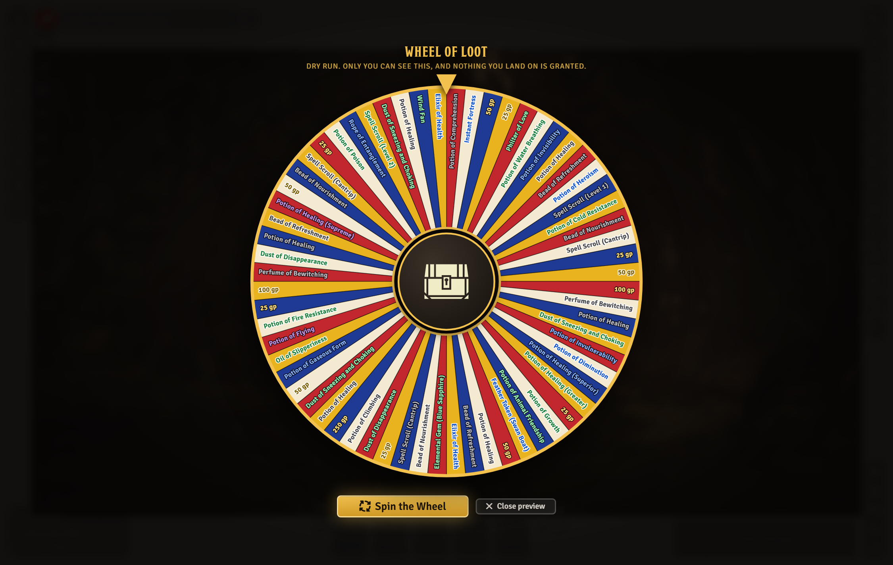
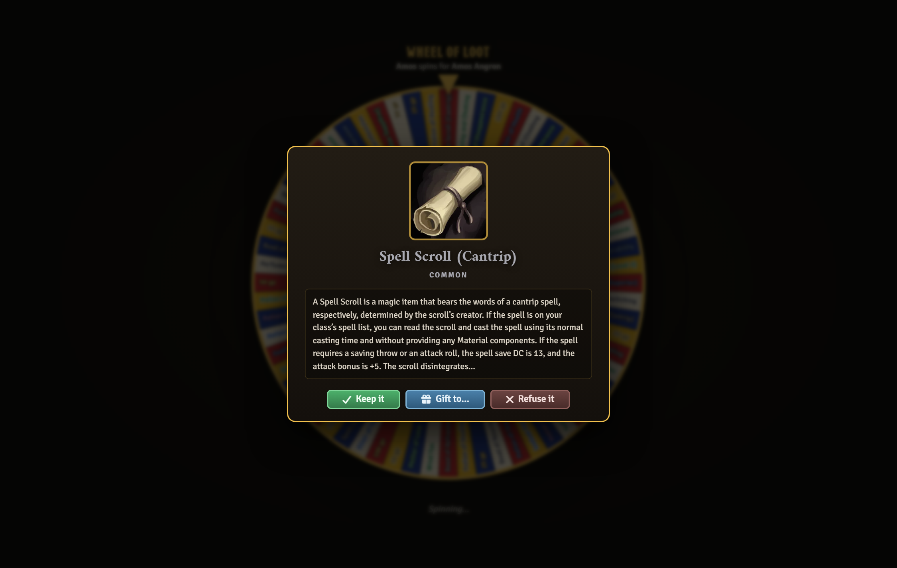
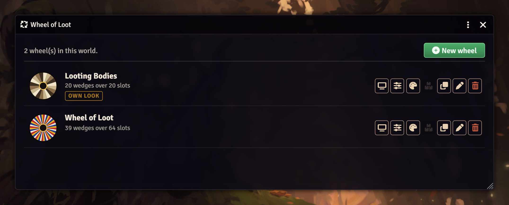
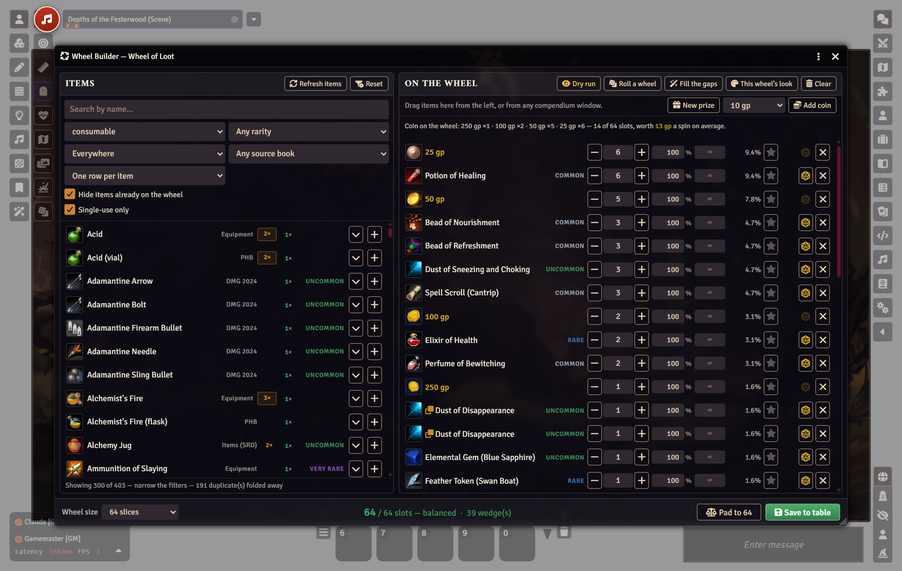

# Wheel of Loot

A broadcast prize wheel for Foundry VTT, driven by a RollTable.

The GM presents a wheel to the whole table and hands out spins. It opens on
**every** client at once, and everybody watches the same wheel land on the same
slice — the spin is genuinely synchronised, not each client animating its own.

**Built for D&D 5e, and not limited to it.** In a 5e world you get rarity colours
on the rim, coin wedges that pay into the right purse, and an item browser that
can tell a three-charge wand from a one-use scroll. Everything system-specific
lives behind one small adapter file, so the module runs in any world.

> **Requirements:** Foundry VTT **v14**, and
> [socketlib](https://github.com/manuelVo/foundryvtt-socketlib).
>
> It should run on **v13** as well: every API it uses existed there, and nothing
> in it is v14-only. That has never been tested on a real v13 world, though, so
> v13 is not declared. If you run it on 13, please
> [say so in an issue](https://github.com/KochiTusker/wheel-of-loot/issues) —
> working or not — and the minimum will follow the evidence.

> **The module ships no prizes.** It is a wheel, not a loot table. What goes on
> it comes from your own world — your compendiums, your system's content, your
> homebrew, or prizes you type in yourself — and the builder is there to make
> assembling that quick. The screenshots on this page use the author's own
> D&D 5e world as an example; none of that content is included.

---

## Winning something

The winner gets confetti and a choice: **keep it**, **gift it** to another
player's character, or **refuse it** and leave it on the wheel for the next
spinner. Keeping it puts the item straight onto their sheet, and coin into their
purse. A result card goes to chat — or only to the GM, or nowhere, if you'd
rather.

Anything the wheel gave out, the GM can take back: **Undo** reverses the last
grant and refunds the spin that bought it.

---

## Getting started

1. **Enable the module.** A single **Wheel of Loot** button appears in the
   **RollTables** sidebar, beside Create Table. Everything is reached from
   there — the module adds nothing to the scene controls.
2. Press it, then **New wheel**. Name it and pick a size.
3. Fill the wheel (below), then **Save to table**.
4. Back in the manager, press the **screen** button on your wheel: give someone
   a spin, and **present it to the table**.

A wheel is an ordinary RollTable, so you can also open the builder from the
table's own sheet header, and organise wheels in folders like anything else.

---

## The manager

Every wheel in the world, each drawn as a small picture of itself — because four
hoards are indistinguishable by name and obvious at a glance as pictures. Badges
say which is broken, which has been looted dry, which carries its own look, and
how many wedges are limited.

From each row: present it, open the builder, set its look and rules, restock it,
duplicate it, rename it, delete it. Duplicating carries the odds, jackpot and
stock across, so "make me another like that one" is one click.

---

## The builder

Catalogue on the left, wheel on the right, running slot total across the bottom.
**Nothing is written until Save**, so experimenting is free.

**Everything classified as an Item** is available: every Item compendium plus
your world's own Items directory, so homebrew shows up beside the official
content — and an item you create while the builder is open appears straight
away. Filter by name, type, rarity, compendium and source book; expand any row
to read what it actually does before committing.

**Duplicates are handled properly.** A world with several imported books has the
same item in it eleven times over. The default folds them to one row per item,
with a badge you can click to pick a specific printing — because four "Dust of
Dryness" entries across four books are *not* interchangeable. Variants are
always collapsed into something you can expand, never discarded.

**Choose the wheel's size.** Presets from 12 to 96 slices, or any number from 2
to 120. Slice colouring, label length and type size all adapt, and the wheel
never puts two same-coloured slices side by side at any size.

**Roll instead of picking:**

| Control | What it does |
| --- | --- |
| **Roll a wheel** | Replaces everything with a random draw from whatever your filters show |
| **Fill the gaps** | Tops the wheel up to its size, leaving your own picks alone |
| 🎲 on a row | Swaps one prize for another, keeping its slot count so your odds survive |
| **Pad to N** | Absorbs any shortfall or excess into the wedge that already has the most slots |

**Weight by rarity** (where the system has rarities) gives commoner prizes more
of the wheel than rare ones, so a legendary stays a thrill rather than a coin
flip.

### Odds you can bend

A grand prize wants to be *seen*. A jackpot squeezed into one hair-thin slice is
invisible, and invisible prizes generate no anticipation.

So every wedge carries an **odds** percentage where 100% means "exactly as likely
as it looks". Three slices wide and weighted to 25% is a wedge the table can see
coming and rarely gets. The builder puts the **true chance beside every wedge**
and colours it when it diverges from what the picture implies — the whole point
of weighting is that the wheel no longer says what it means, so the person
setting it has to see the truth.

Leave everything at 100% and the wheel takes the same flat roll it always did.

### Prizes that aren't items

Not every reward is a document, and the good ones frequently aren't. **New
prize** puts anything on the wheel: a favour owed by the duke, a title, a rumour,
"roll again on the tavern table", a homebrew relic you haven't written up yet.
Give it a name, art, rules text and a rarity, and it behaves like any other
wedge — weighted, made a jackpot, limited to one, and won. Nothing is created on
the winner's sheet; the chat card tells you to hand it over.

The same form **repairs a broken wedge**. If the item behind a prize is deleted,
or lived in a compendium from a module you've since removed, the builder flags it
and offers to keep the wedge as a custom prize instead of making you rebuild it.

### Coin

Name a wedge `250 gp` — or gold / sp / silver / cp / ep / pp, commas allowed —
and it pays into the winner's purse instead of creating an item. **Add coin**
writes these for you, and the bar underneath lists every coin wedge already on
the wheel with what a spin is worth on average. That figure is expected value,
not a total: a 250 gp wedge one slice wide and weighted down to a quarter is not
a 250 gp prize in any sense your players will experience.

### Limited prizes

A wedge can carry a count instead of an endless supply. It is spent when the
prize is actually *taken* — a refused prize is still on offer to the next
spinner — and when it runs out the wedge is **struck through on the rim rather
than vanishing**. The hoard visibly empties as the party loots it, and the wheel
never reshapes itself mid-session. The count is written back to the table, so a
hoard stays looted between sessions.

---

## Dry run

The gap between a list of names and a wheel your players are watching is where
the surprises live — a prize whose name is unreadable at 64 slices, a jackpot
that turns out to be invisible, an odds tweak that quietly made the grand prize
impossible. All of that is obvious in one spin and invisible in an editor.

**Dry run** spins the wheel exactly as the table will meet it: the real layout,
the real art, the real odds, the real confetti. On your screen only — no
session, no broadcast, no credit spent, nothing granted, nothing written. It runs
on the *unsaved* builder state, so you can try a change, look at it, and abandon
it by closing the window.

It uses the same functions the live wheel does to build the entries and choose
the winning slice, rather than a preview-shaped copy of them. A rehearsal that
computed its result differently would be worth nothing.

---

## Every wheel can look different

The world settings are the house style; any individual wheel may disagree. Six
themes set palette and hub together, or bring your own colours and art.

A Dragon's Hoard in ember with a coin hub and a nine-second spin; a Cursed Vault
in midnight that whispers its results to the GM and does not let anyone refuse.

**→ [All the settings, and per-wheel overrides](docs/SETTINGS.md)**

---

## Accessibility

Every control has an accessible name, and the ones that repeat per row say which
prize they belong to — a screen reader announces "Remove Potion of Healing from
the wheel", not "button" forty times. Animation follows each viewer's own
reduced-motion preference by default; with it on, the wheel resolves without the
six-second spin but keeps a beat so the result still reads as an outcome.

---

## More

| | |
| --- | --- |
| **[Troubleshooting](docs/TROUBLESHOOTING.md)** | Why an item isn't in the list, why coin didn't pay out, why the wheel is stuck |
| **[Settings](docs/SETTINGS.md)** | Every knob, its default, and per-wheel overrides |
| **[API and other systems](docs/API.md)** | The module API, and teaching the wheel a new game system |
| **[Development](docs/DEVELOPMENT.md)** | Tests, the four gates, repository layout, how these screenshots are made |
| **[Security](SECURITY.md)** | The threat model, and why the trust boundary is the socket |
| **[Changelog](CHANGELOG.md)** | What changed, and when |

## Licence

MIT. See [LICENSE](LICENSE). The module ships no artwork of its own: every icon
is a path into Foundry's own bundled set.
