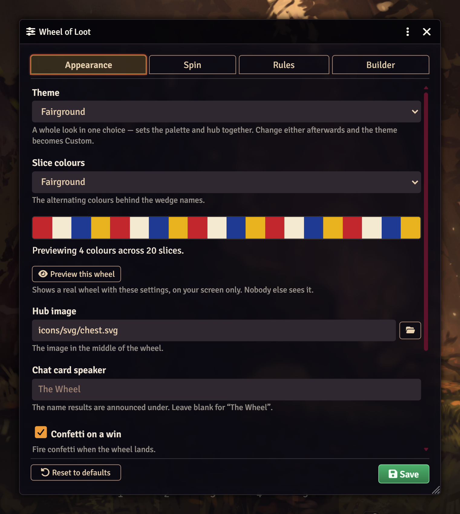

# Settings

**Every setting is in Foundry's own module settings.** Open Game Settings →
Configure Settings → Wheel of Loot. Sliders, dropdowns and file pickers, nothing
hidden behind a sub-menu.

**Configure the wheel** at the top of that section opens the same settings
grouped into four tabs, with a live palette preview and a **Preview this wheel**
button. It is the nicer way in, but it is not the only way in — and it is the
same form used for per-wheel overrides.



## Everything you can change

| | Setting | Control | Default |
| --- | --- | --- | --- |
| **Appearance** | Theme — six looks, each setting palette and hub together | select | Fairground |
|  | Slice colours | select | Fairground |
|  | Custom colours — your own hex list | text | — |
|  | Hub image | file picker | `icons/svg/chest.svg` |
|  | Chat card speaker | text | The Wheel |
|  | Confetti on a win | checkbox | on |
|  | Dim the scene behind | slider 0–1 | 0.82 |
|  | Reduced motion | select | follow each viewer |
| **Spin** | Duration | slider 2–20s | 6s |
|  | Full rotations | slider 1–20 | 6 |
|  | Fairground tick sound *(per client)* | checkbox | on |
|  | Tick volume *(per client)* | slider 0–1 | 0.35 |
|  | Win sound | file picker | none |
| **Rules** | Allow gifting | checkbox | on |
|  | Allow refusing | checkbox | on |
|  | The GM needs a spin too | checkbox | off |
|  | Close when the spins run out | checkbox | on |
|  | Result card — everyone / GM only / none | select | everyone |
| **Builder** | Default wheel size | select | 64 |
|  | Coin amounts | text | 10 … 1000 |
|  | Coin denomination | text | `gp` |

**Every default reproduces the module's pre-2.0 behaviour exactly**, so upgrading
changes nothing until you change something. That promise is pinned by a test.

A silver-standard campaign sets the denomination to `sp`; a horror game takes the
Midnight palette, turns off confetti and whispers the result card to the GM; a
table that wants every spin binding turns off refusing.

## Per-wheel overrides

The world settings are the house style; any individual wheel may disagree.
**This wheel's look** in the builder — or the palette button in the manager —
opens the same form scoped to that wheel: palette, hub, speaker, confetti,
backdrop, spin timing, win sound, and the rules for gifting, refusing, GM spins,
auto-close and the result card.

A blank field means "follow the world setting", and the placeholder tells you
what that is, so a wheel only carries the handful of things it actually differs
on. The manager marks a customised wheel with an **OWN LOOK** badge.

A Dragon's Hoard in ember with a coin hub and a nine-second spin; a Cursed Vault
in midnight that whispers its results to the GM and does not let anyone refuse.

Overrides are resolved on the GM and travel with the wheel when it is presented,
so they apply even to a player who cannot read the RollTable at all. The rules
are enforced GM-side, not merely hidden in the interface.

## Spins are a permission, not a role

The wheel opens for everybody; whether you can *turn* it depends only on whether
you hold a spin. Hand them out in the launcher, or from a macro:

```js
game.modules.get("wheel-of-loot").api.grant({[someUserId]: 2});
```

Each spin is spent on the GM's client *before* the roll happens, so a flood of
clicks can only ever spend what the ledger holds. The wheel closes itself once
every granted spin is used.

---

[← Back to the README](../README.md)
